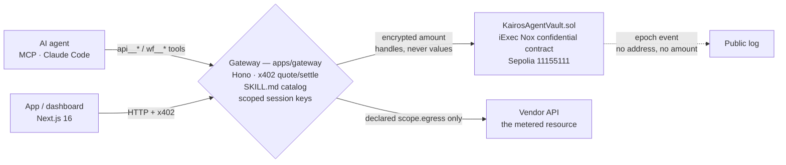
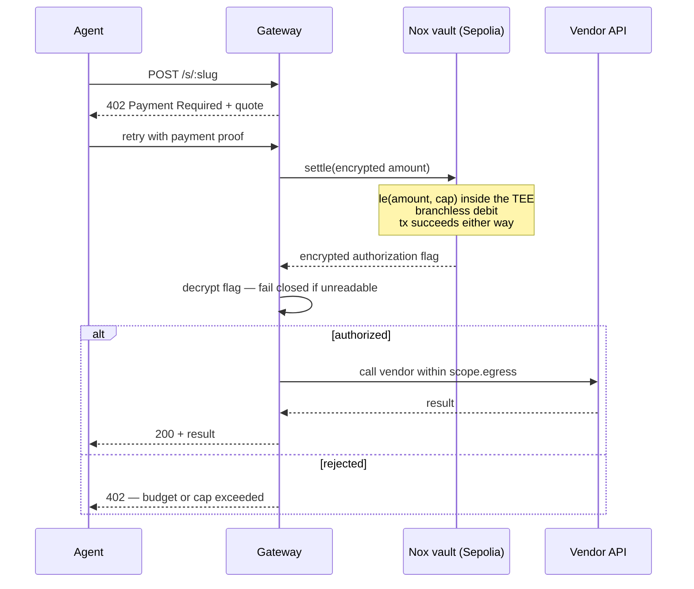
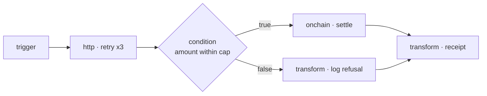
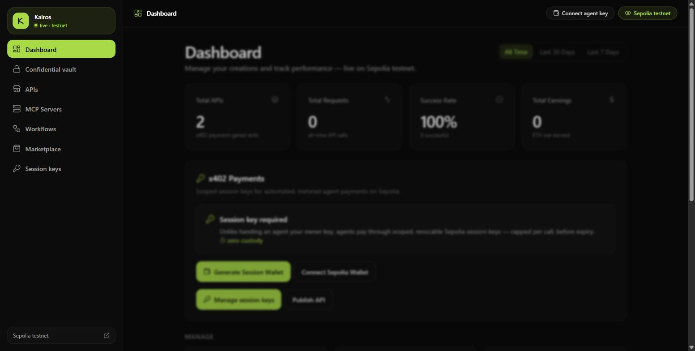
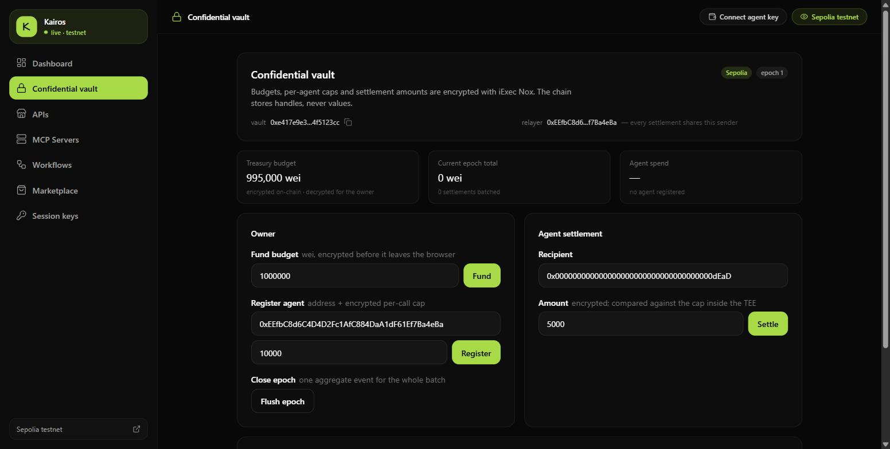
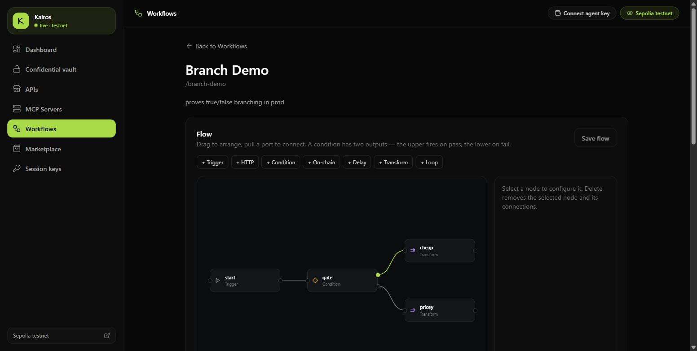
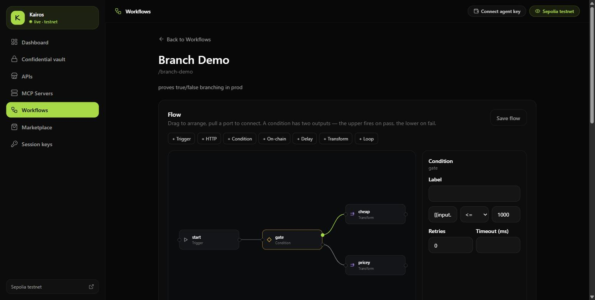

<div align="center">

# Kairos

[](LICENSE)

-FFCC33)
[](https://kairos-frontend-v969.vercel.app/dashboard)


### Give an AI agent a budget it cannot exceed. **Without publishing the budget.**

An agent that pays for things needs a spending limit. Enforcing that limit on a public chain means publishing it — the cap, the running total, and every payment. Kairos keeps the **enforcement** and drops the **disclosure**: budgets and per-agent caps live as encrypted values inside [iExec Nox](https://docs.iex.ec/nox-protocol/getting-started/welcome), are compared inside a TEE, and never appear on-chain in plaintext. x402 and MCP are left exactly as they are — only *authorization and accounting* move into Nox.

**[ Live dashboard ↗ ](https://kairos-frontend-v969.vercel.app/dashboard)** · **[ Verify it yourself ↗ ](#verify-it-yourself-in-30-seconds)** · **[ What is hidden ↗ ](#what-is-hidden-and-what-is-not)** · **[ Run it locally ↗ ](#run-it-locally)**

Built for the **WTF Hackathon Summer Edition** — iExec Nox track.

</div>

---

| | Live now |
|---|---|
| Vault contract | [`0xe417e9e36291a2d74121db0d3ce013854f5123cc`](https://sepolia.etherscan.io/address/0xe417e9e36291a2d74121db0d3ce013854f5123cc) |
| Network | Ethereum Sepolia (`11155111`) |
| NoxCompute | `0x24ef36ec5b626d7dcd09a98f3083c2758f0f77bf` |
| Gateway API | `https://agentfabric-api.187.127.137.136.sslip.io` |
| Dashboard | [`kairos-frontend-v969.vercel.app`](https://kairos-frontend-v969.vercel.app/dashboard) |

---

## Table of contents

- [The problem](#the-problem)
- [Verify it yourself in 30 seconds](#verify-it-yourself-in-30-seconds)
- [What is hidden, and what is not](#what-is-hidden-and-what-is-not)
- [Architecture](#architecture)
- [How the encrypted authorization works](#how-the-encrypted-authorization-works)
- [The payment path, end to end](#the-payment-path-end-to-end)
- [The workflow engine](#the-workflow-engine)
- [The dashboard](#the-dashboard)
- [API](#api)
- [Run it locally](#run-it-locally)
- [Tests](#tests)
- [What's real vs simplified](#whats-real-vs-simplified)
- [Stack](#stack)
- [Layout](#layout)
- [Prior work and what was built for this hackathon](#prior-work-and-what-was-built-for-this-hackathon)

---

## The problem

x402 is an open payment standard: a server answers `402 Payment Required` with a price, the caller pays on-chain, retries with proof, and gets the resource. It is public by design, and that is the right default for a settlement standard.

It is the wrong default for an agent's budget. Run a fleet of agents against metered APIs over x402 and the chain publishes an operational diary: which agent is active, how often, against which vendor, for how much, and how much of its allowance remains. Anyone can read it. For a company that is a competitive leak before it is a privacy problem.

The naive fix — don't enforce the budget on-chain — is worse. Then the cap is a suggestion, and an agent with a compromised prompt drains the treasury.

Kairos enforces the cap **on-chain, in ciphertext**. The comparison happens inside the TEE; the chain stores handles, never values.

## Verify it yourself in 30 seconds

Every claim below is checkable from a terminal right now:

```bash
# The gateway is on the real chain — not demo mode
curl -s https://agentfabric-api.187.127.137.136.sslip.io/chain/status
# → {"configured":true,"demoMode":false,"network":"testnet",
#    "rpcUrl":"https://ethereum-sepolia-rpc.publicnode.com", ...}

# The confidential vault is live, with its relayer and current epoch
curl -s https://agentfabric-api.187.127.137.136.sslip.io/nox/status
# → {"configured":true,
#    "vaultAddress":"0xe417e9e36291a2d74121db0d3ce013854f5123cc",
#    "relayer":"0xEEfbC8d6C4D4D2Fc1AfC884DaA1dF61Ef7Ba4eBa",
#    "network":11155111,"epoch":1, ...}

# The encrypted treasury, decrypted for the owner
curl -s https://agentfabric-api.187.127.137.136.sslip.io/nox/budget
# → {"budgetWei":"995000","epochTotalWei":"0","epoch":1,"epochCount":0}
```

`demoMode: false` is the load-bearing field. The dashboard's mode banner reads from the same source, so it cannot claim a real settlement while running against a stub.

## What is hidden, and what is not

Being precise about this matters more than the feature list.

**Private** — encrypted handles, decryptable only by permitted accounts:

- the treasury budget and what remains of it
- each agent's per-call spending cap
- each agent's cumulative spend
- the amount of any individual settlement
- **whether a given settlement was authorized or rejected**

**Public:**

- that a settlement occurred, and in which epoch
- how many settlements a batch contained
- the relayer address that submitted the transaction

Two design choices produce the counterparty privacy. Settlement events carry **no addresses and no amount** — only an epoch number — so logs cannot be used to build a payment graph. And debits **batch**: they accumulate into an encrypted epoch total that the owner flushes as one aggregate event, so there is no one-transaction-per-API-call trail to correlate by timing.

**Known limitation, stated plainly:** `msg.sender` is inherently public. Kairos routes settlements through a single gateway relayer, so on-chain every settlement shares one sender and per-agent activity is not distinguishable — but the relayer itself is visible, and it learns what it relays.

## Architecture

Authority narrows at every hop, and the plaintext stops at the browser:



| Package | Responsibility |
|---|---|
| `packages/manifest` | SKILL.md parser + validator — the manifest contract |
| `packages/fabric-core` | Workflow **graph engine** (`runGraph`), template resolver, MCP tool registration |
| `packages/nox-chain` | `NoxVaultClient` over `@iexec-nox/handle` — encrypt, settle, decrypt |
| `packages/evm-chain` | Sepolia transfers + chain status |
| `packages/authz` | Scoped session keys |
| `packages/sdk` | Client surface |
| `apps/gateway` | Hono API — x402, catalog, `/nox/*`, `/fabric/*` (the only holder of keys) |
| `apps/web` | Next.js 16 dashboard — 7 surfaces |
| `apps/mcp-server` | MCP gateway — skills become agent tools over stdio |
| `services/{catalog,payments,execution,identity,chain-worker}` | Persistence, metering, execution, chain writes |

## How the encrypted authorization works

An `ebool` cannot gate a `require`. Reverting on an encrypted comparison would leak the comparison result, which defeats the purpose. So authorization is **branchless**:

```solidity
ebool  withinCap = Nox.le(amount, s.capPerCall);
euint256 requested = Nox.select(withinCap, amount, zero);

// safeSub reports underflow as an encrypted flag rather than reverting,
// which would leak whether the treasury covered the payment.
(ebool funded, euint256 remaining) = Nox.safeSub(budget, requested);

euint256 debited = Nox.select(funded, requested, zero);
budget          = Nox.select(funded, remaining, budget);
```

An over-cap call debits **zero** and the transaction still **succeeds** — indistinguishable on-chain from an authorized one. The outcome is written to an encrypted flag that only the owner and that agent can decrypt, and the gateway **fails closed** on it: if the flag cannot be read, the paid action does not proceed.

That last clause is the whole security argument. A gateway that treated an unreadable flag as "probably fine" would hand out the resource for free.

## The payment path, end to end



The 402 surface is unchanged from plain x402. An agent that has never heard of Nox still works; it just doesn't get the privacy.

## The workflow engine

Beyond single calls, Kairos runs **workflows** — graphs of nodes an agent executes as one tool call (`wf__<slug>`). The engine is built from scratch in `packages/fabric-core`, not adapted from an existing tool.

The scheduling rule is one sentence, and everything else falls out of it:

> A node becomes runnable once **every predecessor has settled**, and actually runs if **at least one incoming edge fired**.

That single rule produces fan-out, join, and skip-propagation with no special "parallel" or "merge" node type — nodes that become ready together simply execute together.



| Capability | Detail |
|---|---|
| Branching | `true` / `false` edges out of a condition. An **unbranched** edge fires on pass only — which preserves the earlier halt-on-false behaviour exactly |
| Parallelism | Ready nodes run concurrently; a join waits for every upstream branch |
| Retry | Per-node `retry: { max, backoffMs }`, linear backoff, attempts reported per run |
| Timeout | Per-node `timeoutMs` |
| Node kinds | `trigger` · `http` · `condition` · `onchain` · `delay` · `transform` · `loop` (bounded to 100 items) |
| Validation | Cycles, dangling edges, duplicate ids and missing entry points are rejected at publish time with `400` |
| Run history | Every execution persists with per-node status, attempt count and duration |
| Guard | Hard stop at 500 node executions per run |

Legacy flat `steps` arrays convert to a linear graph on load, so workflows published before the engine existed keep running untouched.

### Verified branching, on the live deployment

```bash
curl -sX POST $API/fabric/run/workflow -d '{"slug":"branch-demo","input":{"amount":"500"}}'
# → completed | start:ok  gate:ok       pricey:skipped  cheap:ok

curl -sX POST $API/fabric/run/workflow -d '{"slug":"branch-demo","input":{"amount":"5000"}}'
# → completed | start:ok  gate:skipped  cheap:skipped   pricey:ok
```

## The dashboard

Seven surfaces at [`/dashboard`](https://kairos-frontend-v969.vercel.app/dashboard) — Dashboard, Confidential vault, APIs, MCP Servers, Workflows, Marketplace, Session keys.

| Dashboard — x402 metering | Confidential vault — live encrypted treasury |
|---|---|
|  |  |

| Workflow canvas — the branch is drawn, not described | Node inspector — retry, timeout, per-kind config |
|---|---|
|  |  |

The vault panel ends with the thesis in one block — **what an observer sees** (a settlement happened, how many were batched, the shared relayer) against **what stays private** (the budget, every cap, every amount, and whether any given settlement was authorized).

The workflow canvas is hand-built on SVG and positioned elements — no canvas library. Drag to arrange, pull a port to connect, click to configure. A condition node exposes two output ports, so a branch is drawn rather than explained.

## API

Base: `https://agentfabric-api.187.127.137.136.sslip.io`

**Confidential vault**

```
GET    /nox/status           vault address, relayer, current epoch
GET    /nox/budget           owner-decrypted budget + epoch total
POST   /nox/fund             fund with an encrypted amount
POST   /nox/agents           register an agent with an encrypted cap
GET    /nox/agents/:agent    ACL-gated decrypted cap and spend
DELETE /nox/agents/:agent    revoke in one transaction
POST   /nox/settle           settle; 402 when not authorized
GET    /nox/epoch            batching state
POST   /nox/epoch/flush      close the batch
```

**x402 + catalog**

```
POST   /skills               publish a SKILL.md
GET    /skills               list published skills
POST   /s/:slug              402 quote → execute on retry with proof
POST   /s/:slug/auto-pay     settle and execute in one call
GET    /chain/status         configured · demoMode · rpc · explorer
GET    /payments/usage       metering
```

**Session keys**

```
GET    /auth/session-keys            list scoped keys
POST   /auth/session-keys            mint a scoped, expiring key
DELETE /auth/session-keys/:pubkey    revoke
```

**Workflows + runs**

```
GET    /fabric/workflows                 list
POST   /fabric/workflows                 publish (graph validated; 400 on cycle)
GET    /fabric/workflows/:slug           fetch
PUT    /fabric/workflows/:slug/graph     save a canvas-authored graph
POST   /fabric/run/workflow              execute
GET    /fabric/runs[?workflow=&limit=]   execution history
GET    /fabric/runs/:id                  one run, per-node detail
```

Plus `/fabric/apis`, `/fabric/mcp-servers`, `/fabric/stats`, `/fabric/logs`, `/fabric/activity`, `/health`.

## Run it locally

Prerequisites: [Bun](https://bun.sh).

```bash
bun install
cp .env.example .env          # add SEPOLIA_RPC_URL + a funded key

bun run gateway:dev           # API on :8080
bun run web:dev               # dashboard on :3000 → /dashboard
```

Deploy the vault and drive the full confidential lifecycle:

```bash
cd contracts && bun install
bun run deploy:sepolia        # prints VAULT_CONTRACT_ADDRESS

cd .. && bun run nox:demo
```

`bun run nox:demo` funds an encrypted budget, registers an agent with an encrypted cap, settles once **within** cap (authorized) and once **over** it (rejected), shows the owner-decrypted balance moving by exactly the authorized amount, then flushes the epoch. Every step prints a real Sepolia transaction.

Expose skills to Claude Code over MCP:

```bash
bun run fabric:mcp            # stdio MCP server → api__* and wf__* tools
```

## Tests

```bash
bun test          # 73 tests across 11 files — 68 pass, 5 skip
bun run typecheck # all 14 workspaces
```

The workflow engine carries 18 of those, and they are behavior-first: both branch directions, the halt-on-false legacy path, a parallel-timing assertion, a fan-out/join, retry-then-succeed and retry-then-exhaust, a timeout, template resolution across nodes, loop iteration, and downstream-of-failure containment. Graph validation has cycle, dangling-edge and duplicate-id coverage.

Two real bugs were caught by that suite rather than by review: a loop body being template-resolved before the loop could bind `item`, and a sub-pixel pointer move marking an unedited flow dirty.

## What's real vs simplified

| Capability | Status |
|---|---|
| **Confidential vault on Sepolia** | Real. Deployed, `demoMode: false`, live encrypted budget. |
| **Branchless encrypted authorization** | Real. `Nox.le` + `Nox.select` + `safeSub`; over-cap debits zero and still succeeds. |
| **Fail-closed gateway** | Real. An unreadable authorization flag blocks the paid action. |
| **Address-free settlement events + epoch batching** | Real. Events carry an epoch number only. |
| **x402 quote → pay → retry** | Real. Unchanged public surface. |
| **Workflow graph engine** | Real. Branching, parallelism, retry, timeout, loop, run history — 18 tests, verified on the live deployment. |
| **Graph validation** | Real. Cycles and dangling edges rejected with `400` at publish time. |
| **MCP tools** | Real. Skills and workflows appear as `api__*` / `wf__*` over stdio. |
| The relayer | **Trusted.** It submits every settlement, so it learns what it relays even though the chain does not. |
| Skill execution | `scope.egress` allowlist bounds where a skill reaches. **Not a sandbox** — which is why skills declare an endpoint rather than ship a body. |
| Fabric state | JSON snapshot on disk — durable for one node. Multi-node wants the Postgres path (`DATABASE_URL`), which the catalog already uses. |
| Not built (never faked) | Mainnet · audit · multi-relayer anonymity set · in-process code sandboxing. |

**Sepolia testnet only. Not audited. Do not put real funds behind it.**

## Stack

Solidity 0.8.35 · Hardhat 3 · `@iexec-nox/nox-protocol-contracts` · `@iexec-nox/handle` · Bun · TypeScript · Hono · Next.js 16 · React 19 · ethers v6

Deploy: Vercel (web) + a VPS with Caddy auto-TLS (gateway, Postgres, Redis, NATS, MinIO under Docker Compose).

## Layout

```
contracts/            KairosAgentVault.sol — the confidential vault
packages/
  manifest/           SKILL.md parser + validator
  fabric-core/        graph engine (engine.ts · graph.ts) · resolver · MCP registration
  nox-chain/          NoxVaultClient over @iexec-nox/handle
  evm-chain/          Sepolia transfers + chain status
  authz/  sdk/
apps/
  gateway/            Hono API — x402, catalog, /nox/*, /fabric/*
  web/                Next.js 16 dashboard (7 surfaces)
  mcp-server/         MCP gateway — skills as agent tools
services/             catalog · payments · execution · identity · chain-worker
scripts/nox-demo.ts   end-to-end confidential settlement
docs/                 ARCHITECTURE · WTF-HACKATHON · VPS-DEPLOY · VERCEL-DEPLOY · SANDBOX
```

## Prior work and what was built for this hackathon

This repository has history before the WTF hackathon, and the brief asks that this be stated explicitly.

**Pre-existing:** the x402 gateway and quote/settle flow, the SKILL.md manifest parser and catalog, the MCP server, the Next.js dashboard shell and marketplace, and a linear workflow runner. Earlier iterations targeted other chains; that lineage is in the git history.

**Built during this hackathon:**

- `contracts/KairosAgentVault.sol` — the confidential vault: branchless encrypted authorization, `safeSub`-based debiting, address-free settlement events, epoch batching
- `packages/nox-chain` — the entire Nox client layer
- `apps/gateway/src/nox.ts` — the `/nox/*` API
- `apps/web/components/fabric/nox-vault-section.tsx` — the vault dashboard
- `packages/fabric-core/{engine,graph}.ts` — the workflow **graph** engine that replaced the linear runner, plus the drag-and-drop canvas in `apps/web/components/fabric/workflow-{canvas,graph-editor}.tsx`
- `scripts/nox-demo.ts`, the Hardhat 3 migration, and `feedback.md`

No part of this project was submitted to the previous VIBE Coding Hackathon.

Builder feedback on the iExec tooling is in [`feedback.md`](./feedback.md).

## License

MIT — see [LICENSE](LICENSE).
